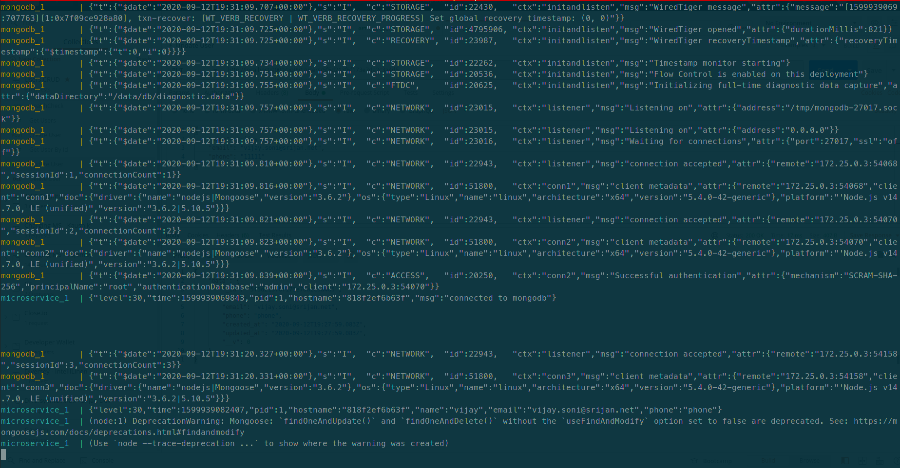

# nodejs-mongodb-microservice

## Data Model

- User:
  - name (required)
  - email (required)
  - phone

---

## Pre-requisites

- NodeJS
- MongoDB

## Installation

```shell
# Using npm
npm install

# Using yarn
yarn add
```

---

## Running

- Make sure to create `.env` file from `.env.example` and fill values accordingly

### Run without Docker

```shell
# For Local Development
npm run dev

# On Production, Use pm2 or docker container
pm2 start src/app.js

# OR
node src/app.js
```

### Run using Docker

```shell
# Build Image
docker build -t nodejs-microservice .

# Run Container
docker run -it -p 9000:9000 --env-file .env nodejs-microservice
```

### Run using Docker Compose

```shell
# Using Docker Compose
docker-compose up

# Stop Docker Compose
docker-compose down
```

### Run on Kubernetes

- Make sure kubernetes cluster is setup already (use Minikube, Kind, k3s, or MicroK8S)
- This deploys the node application only, DB should be hosted somewhere else. Update the env variables from file (`./kubernetes/deploy-node-app.yml`)
- Using Minikube: Run following
  - `$(minikube docker-env)`
  - `minikube start --insecure-registry`
  - `docker build -t nodejs-microservice .`

```shell
# Deploy to Kubernetes Cluster
kubectl apply -f ./kubernetes/deploy-node-app.yml

# Remove from Kubernetes Cluster
kubectl delete -f ./kubernetes/deploy-node-app.yml
```

---

## APIs

| Method | Endpoint | Description |
| --- | --- | --- |
| GET | /api/v1/healthz | Health Check |
| GET | /api/v1/users | Get All Users |
| POST | /api/v1/users | Create a User |
| GET | /api/v1/users/\<id\> | Get User By Id |
| PUT | /api/v1/users/\<id\> | Update a User |
| DELETE | /api/v1/users/\<id\> | Delete a User |

---

## PR Gate Process

To ensure the quality and integrity of the codebase, all pull requests must pass through a PR gate before being merged. This process involves automated checks that are run via GitHub Actions as defined in the `.github/workflows/pr-gate.yml` file.

### Running Tests Locally

Before submitting a pull request, you can run tests locally to ensure your changes pass all checks:

```shell
npm test
```

This command will run all unit tests in the project, ensuring that your changes do not break any existing functionality.

### GitHub Actions Workflow

The GitHub Actions workflow for the PR gate includes steps for linting with ESLint, running unit tests, and building the Docker image. This workflow is triggered automatically upon the creation of a pull request to the main branch. A pull request can only be merged once all checks have passed successfully.

---

## Features

- Follows RESTful API Patterns
- Used ES6
- Modular Structure
- Graceful Shutdown

## Enhancement Scope

- Can create OpenAPI Specs (or Swagger API Specs)
- Can use Dependency Injection / IoC
- API result can be paginated
- Can use TypeScript
- Handle CORS Headers
- Add Security Headers

---

### Screenshots

- Docker Compose Output


