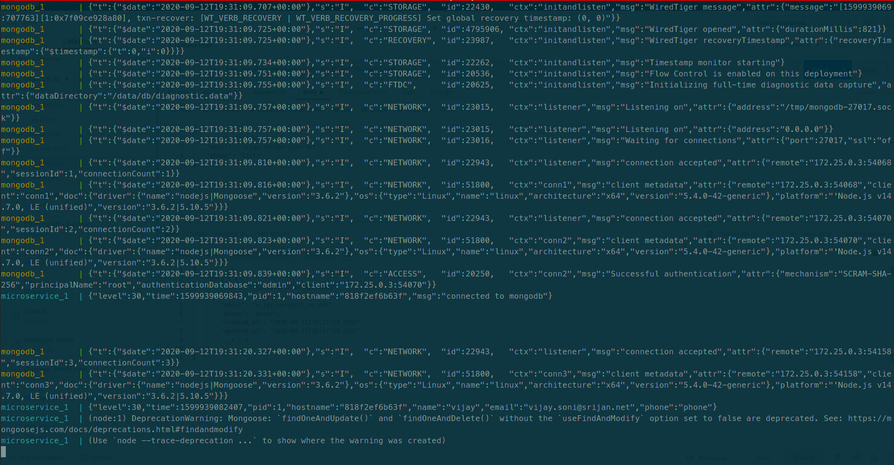

# nodejs-mongodb-microservice

## Data Model

- User:
  - name (required)
  - email (required)
  - phone

---

## Pre-requisites

- NodeJS
- MongoDB

## Installation

```shell
# Using npm
npm install

# Using yarn
yarn add
```

---

## Running

```shell
# For Local Development
npm run dev

# Using Docker Compose
docker-compose up

# On Production, Use pm2 or docker container
pm2 start src/app.js

# OR
node src/app.js
```

---

## APIs

| Method | Endpoint | Description |
| --- | --- | --- |
| GET | /api/v1/healthz | Health Check |
| GET | /api/v1/users | Get All Users |
| POST | /api/v1/users | Create a User |
| GET | /api/v1/users/\<id\> | Get User By Id |
| PUT | /api/v1/users/\<id\> | Update User |
| DELETE | /api/v1/users/\<id\> | Delete a User |

---

## Features

- Follows RESTful API Patterns
- Used ES6
- Modular Structure
- Graceful Shutdown

## Enhancement Scope

- Can create OpenAPI Specs (or Swagger API Specs)
- Can use Dependency Injection / IoC
- API result can be paginated
- Can use TypeScript
- Handle CORS Headers
- Add Security Headers

---

### Screenshots

- Docker Compose Output


